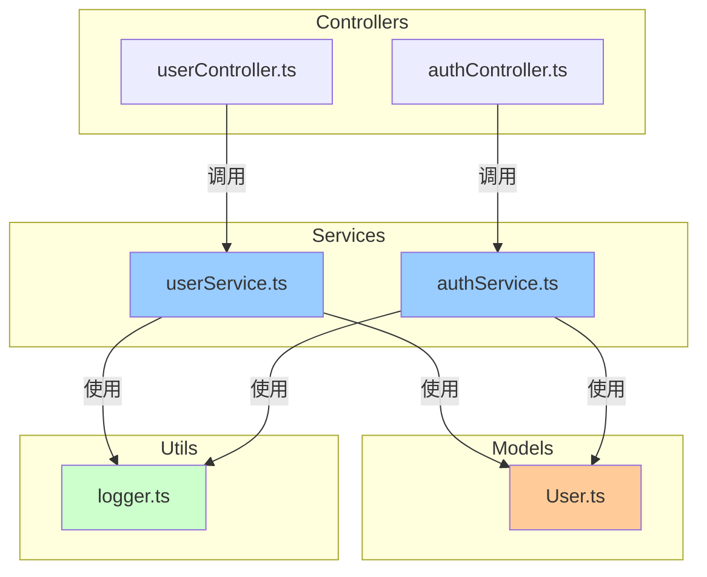

# 使用示例 (Usage Examples)

[简体中文](#简体中文) | [English](#english)

---

## 简体中文

本文档提供项目多级索引系统的完整使用示例，包括典型场景和输出效果。

---

## 目录

1. [示例 1: 初始化新项目](#示例-1-初始化新项目)
2. [示例 2: 自动更新演示](#示例-2-自动更新演示)
3. [示例 3: 一致性检查](#示例-3-一致性检查)
4. [示例 4: 切换语言](#示例-4-切换语言)
5. [示例 5: CLI 工具使用](#示例-5-cli-工具使用)
6. [完整项目结构示例](#完整项目结构示例)
7. [生成的索引文件示例](#生成的索引文件示例)

---

## 示例 1: 初始化新项目

### 场景

您刚刚克隆了一个开源项目，想要快速了解其架构和依赖关系。

### 操作步骤

```
User: /project-multilevel-index:init-index

Claude: 确认当前目录是 h:/opensource-app 吗？

User: 是的

Claude:
正在扫描项目...
发现:
- TypeScript: 45 文件
- Python: 12 文件
- 总计: 57 个代码文件

正在分析依赖关系...
✔ 已分析 57 个文件

正在生成索引...
✔ 已生成 57 个文件头注释
✔ 已生成 8 个 FOLDER_INDEX.md
✔ 已生成 PROJECT_INDEX.md

正在生成依赖关系图...
✔ 依赖图包含 32 个节点, 48 条边

✅ 索引系统初始化完成！

项目结构:
├── src/
│   ├── controllers/ (6 文件)
│   ├── services/ (8 文件)
│   ├── models/ (5 文件)
│   ├── utils/ (12 文件)
│   └── middleware/ (4 文件)
├── tests/ (18 文件)
└── scripts/ (4 文件)

📖 查看 PROJECT_INDEX.md 了解完整架构
🔍 查看各文件夹的 FOLDER_INDEX.md 了解模块详情
```

### 生成的文件

- ✅ 57 个文件头注释（Input/Output/Pos）
- ✅ 8 个 FOLDER_INDEX.md
- ✅ 1 个 PROJECT_INDEX.md（含 Mermaid 依赖图）

---

## 示例 2: 自动更新演示

### 场景

您在开发过程中修改了一个服务文件，添加了新的依赖和导出。

### 操作步骤

#### 步骤 1: 修改代码文件

您编辑 `src/services/authService.ts`，添加：

```typescript
// 新增导入
import bcrypt from 'bcrypt';
import jwt from 'jsonwebtoken';

// 新增导出
export async function hashPassword(password: string): Promise<string> {
  return bcrypt.hash(password, 10);
}

export function generateToken(userId: string): string {
  return jwt.sign({ userId }, process.env.JWT_SECRET!);
}
```

#### 步骤 2: 自动更新触发

```
[Claude Code 检测到文件变更]

Claude (后台自动执行):
检测到结构性变更: src/services/authService.ts
→ 新增依赖: bcrypt, jsonwebtoken
→ 新增导出: hashPassword(), generateToken()

正在更新索引...
✔ 更新 authService.ts 文件头
✔ 更新 services/FOLDER_INDEX.md
✔ 更新 PROJECT_INDEX.md 依赖图

[用户界面显示通知]
[索引系统] 已自动更新 authService.ts 的索引
```

#### 步骤 3: 查看更新后的文件头

```typescript
/**
 * Input: bcrypt, jsonwebtoken, ./models/User, ./utils/logger
 * Output: AuthService 类, login(), register(), hashPassword(), generateToken()
 * Pos: 业务层-认证服务，处理用户认证和JWT令牌管理
 *
 * 本注释在文件修改时自动更新
 */

import bcrypt from 'bcrypt';
import jwt from 'jsonwebtoken';
// ...
```

### 智能检测逻辑

| 变更类型 | 是否触发更新 | 原因 |
|---------|------------|------|
| 新增 `import bcrypt` | ✅ 是 | 结构性变更（依赖变化） |
| 新增 `export function` | ✅ 是 | 结构性变更（接口变化） |
| 修改函数内部逻辑 | ❌ 否 | 非结构性变更 |
| 修改注释 | ❌ 否 | 非结构性变更 |
| 格式化代码 | ❌ 否 | 非结构性变更 |

---

## 示例 3: 一致性检查

### 场景

您在团队协作中发现索引可能不同步，想要检查并修复问题。

### 操作步骤

```
User: /project-multilevel-index:check-index

Claude:
正在检查索引一致性...

索引一致性检查报告
==================

📊 检查项目统计
- 代码文件总数: 57
- 文件夹总数: 8
- 依赖关系总数: 48

✅ 文件头完整性: 55/57 (96.5%)
  缺失注释的文件:
  - src/utils/legacy.js
  - src/temp/test.ts

✅ 文件夹索引: 8/8 (100%)
  所有文件夹都有 FOLDER_INDEX.md

⚠️ 依赖关系准确性: 发现 1 个问题
  循环依赖检测:
  - src/services/userService.ts
    → src/services/authService.ts
    → src/services/emailService.ts
    → src/services/userService.ts

✅ 索引结构规范: 符合标准

✅ 孤立文件: 0 个
  所有代码文件都已被索引

📈 总体评分: 8.5/10 (良好)

🔧 建议修复步骤:
1. 运行 /project-multilevel-index:update-index
   → 自动补充 legacy.js 和 test.ts 的文件头注释

2. 重构循环依赖:
   → 考虑将共享逻辑提取到独立模块
   → 或使用依赖注入打破循环

3. 验证修复:
   → 修复后重新运行 check-index
```

### 详细问题分析

#### 问题 1: 缺失文件头注释

```
位置: src/utils/legacy.js
原因: 可能是旧代码，未被索引系统处理
影响: 该文件不会出现在依赖图中
修复: 运行 update-index 或手动添加注释
```

#### 问题 2: 循环依赖

```
循环路径:
userService.ts (需要 authService 验证用户身份)
    ↓
authService.ts (需要 emailService 发送验证邮件)
    ↓
emailService.ts (需要 userService 获取用户信息)
    ↓
userService.ts (形成循环)

建议方案:
1. 创建独立的 UserRepository 层
2. 使用事件驱动架构（发布-订阅模式）
3. 将共享逻辑抽取到 shared/utils/
```

---

## 示例 4: 切换语言

### 场景

您的团队有国际成员，需要切换到英文界面。

### 操作步骤

```
User: /project-multilevel-index:set-language

Claude:
当前语言设置
=============
📌 当前语言: 简体中文 (zh-CN)
📂 配置文件: .claude/locale-config.json

可选语言:
1. 🇨🇳 简体中文 (zh-CN) - 默认
2. 🇺🇸 English (en-US)

请选择目标语言（输入数字 1-2）:

User: 2

Claude:
✅ 语言切换成功!

新配置:
- 语言: English (en-US)
- 回退语言: 简体中文 (zh-CN)

配置已保存到: .claude/locale-config.json

下次执行命令时将使用英文界面。

提示: 如需更新已生成的索引文件为英文，请运行:
/project-multilevel-index:init-index
```

### 配置文件内容

`.claude/locale-config.json`:

```json
{
  "language": "en-US",
  "fallback": "zh-CN",
  "lastUpdated": "2025-12-24T10:30:00Z"
}
```

---

## 示例 5: CLI 工具使用

### 场景

您想在 CI/CD 流程中自动生成文档。

### 操作步骤

#### 步骤 1: 安装 CLI 工具

```bash
cd project-multilevel-index/cli
npm install && npm run build
npm link
```

#### 步骤 2: 运行索引生成

```bash
cd /path/to/your/project
codex init
```

#### 步骤 3: 查看输出

```
🎼 Fractal Multi-level Index System
====================================

📂 Project root: /path/to/your/project

[1/5] 扫描项目结构...
✔ Found 45 code files across 8 folders

[2/5] 分析依赖关系...
✔ Analyzed 45 files (10 TypeScript, 12 Python, 8 Java, 15 other)

[3/5] 生成文件头注释...
✔ Generated 45 file headers

[4/5] 生成文件夹索引...
✔ Generated 8 FOLDER_INDEX.md files

[5/5] 生成项目索引...
✔ Generated PROJECT_INDEX.md
✔ Generated dependency graph (32 nodes, 45 edges)

✅ Index system initialized successfully!

📊 Statistics:
- Total files: 45
- Total folders: 8
- Dependencies: 45
- Circular dependencies: 0

📖 View the project index:
   /path/to/your/project/PROJECT_INDEX.md

⏱️ Completed in 3.2s
```

#### 步骤 4: 集成到 CI/CD

`.github/workflows/docs.yml`:

```yaml
name: Update Documentation

on:
  push:
    branches: [main]

jobs:
  update-docs:
    runs-on: ubuntu-latest
    steps:
      - uses: actions/checkout@v3

      - name: Setup Node.js
        uses: actions/setup-node@v3
        with:
          node-version: '18'

      - name: Install codex
        run: |
          git clone https://github.com/Claudate/project-multilevel-index.git
          cd project-multilevel-index/cli
          npm install && npm run build
          npm link

      - name: Generate index
        run: codex init

      - name: Commit changes
        run: |
          git config user.name "GitHub Actions"
          git config user.email "actions@github.com"
          git add PROJECT_INDEX.md **/FOLDER_INDEX.md
          git commit -m "docs: update project index [skip ci]" || echo "No changes"
          git push
```

---

## 完整项目结构示例

### 初始化前

```
my-project/
├── src/
│   ├── controllers/
│   │   ├── userController.ts
│   │   └── authController.ts
│   ├── services/
│   │   ├── userService.ts
│   │   └── authService.ts
│   ├── models/
│   │   └── User.ts
│   └── utils/
│       └── logger.ts
├── tests/
│   └── user.test.ts
├── package.json
└── README.md
```

### 初始化后

```
my-project/
├── src/
│   ├── controllers/
│   │   ├── userController.ts          ← 已添加文件头注释
│   │   ├── authController.ts          ← 已添加文件头注释
│   │   └── FOLDER_INDEX.md            ← 新生成
│   ├── services/
│   │   ├── userService.ts             ← 已添加文件头注释
│   │   ├── authService.ts             ← 已添加文件头注释
│   │   └── FOLDER_INDEX.md            ← 新生成
│   ├── models/
│   │   ├── User.ts                    ← 已添加文件头注释
│   │   └── FOLDER_INDEX.md            ← 新生成
│   ├── utils/
│   │   ├── logger.ts                  ← 已添加文件头注释
│   │   └── FOLDER_INDEX.md            ← 新生成
│   └── FOLDER_INDEX.md                ← 新生成
├── tests/
│   ├── user.test.ts                   ← 已添加文件头注释
│   └── FOLDER_INDEX.md                ← 新生成
├── PROJECT_INDEX.md                   ← 新生成
├── package.json
└── README.md
```

---

## 生成的索引文件示例

### PROJECT_INDEX.md 示例

```markdown
# My Project - 项目索引

## 项目概览

一个现代化的 Web 应用，采用 TypeScript + Express 构建，实现用户认证和管理功能。

## 目录结构

```
my-project/
├── src/                  # 源代码目录
│   ├── controllers/      # API 控制器层
│   ├── services/         # 业务逻辑层
│   ├── models/           # 数据模型层
│   └── utils/            # 工具函数
└── tests/                # 测试文件
```

## 架构分层

### API 层 (Controllers)
- **职责**: 处理 HTTP 请求和响应
- **文件数**: 2
- **主要模块**: userController, authController

### 业务层 (Services)
- **职责**: 核心业务逻辑
- **文件数**: 2
- **主要模块**: userService, authService

### 数据层 (Models)
- **职责**: 数据模型定义
- **文件数**: 1
- **主要模块**: User

### 工具层 (Utils)
- **职责**: 通用工具函数
- **文件数**: 1
- **主要模块**: logger

## 依赖关系图



## 模块清单

详见各文件夹的 FOLDER_INDEX.md:
- [src/controllers/FOLDER_INDEX.md](src/controllers/FOLDER_INDEX.md)
- [src/services/FOLDER_INDEX.md](src/services/FOLDER_INDEX.md)
- [src/models/FOLDER_INDEX.md](src/models/FOLDER_INDEX.md)
- [src/utils/FOLDER_INDEX.md](src/utils/FOLDER_INDEX.md)

---
⚠️ **自动维护**: 此文件由索引系统自动生成和更新
```

### FOLDER_INDEX.md 示例

`src/services/FOLDER_INDEX.md`:

```markdown
# src/services 文件夹索引

## 架构说明

业务逻辑层，封装核心业务规则和数据访问逻辑。
采用服务模式，每个服务对应一个业务领域。
服务之间通过依赖注入解耦，便于测试和维护。

## 文件清单

### userService.ts
- **角色**: 用户管理核心服务
- **功能**: 用户 CRUD、查询、验证
- **依赖**: User 模型, logger, database
- **被使用**: userController, authMiddleware

### authService.ts
- **角色**: 认证授权服务
- **功能**: JWT 生成、令牌验证、登录登出
- **依赖**: userService, bcrypt, jsonwebtoken
- **被使用**: authController, authMiddleware

## 依赖关系

```
authService → userService → User 模型
              ↓
          logger (日志记录)
```

---
⚠️ **自指性**: 本文件夹内容变化时，请更新此索引
```

### 文件头注释示例

`src/services/userService.ts`:

```typescript
/**
 * Input: ./models/User, ./utils/logger, ./utils/database
 * Output: UserService 类, createUser(), getUserById(), updateUser(), deleteUser()
 * Pos: 业务层-用户服务，处理用户相关业务逻辑
 *
 * 本注释在文件修改时自动更新，触发 FOLDER_INDEX 和 PROJECT_INDEX 同步更新
 */

import { User } from './models/User';
import { logger } from './utils/logger';
import { database } from './utils/database';

export class UserService {
  async createUser(data: Partial<User>): Promise<User> {
    logger.info('Creating user', data);
    return database.users.create(data);
  }

  async getUserById(id: string): Promise<User | null> {
    return database.users.findById(id);
  }

  async updateUser(id: string, data: Partial<User>): Promise<User> {
    logger.info('Updating user', { id, data });
    return database.users.update(id, data);
  }

  async deleteUser(id: string): Promise<void> {
    logger.info('Deleting user', { id });
    await database.users.delete(id);
  }
}
```

---

## 相关文档

- [COMMANDS.md](COMMANDS.md) - 命令详细说明
- [FILE_HEADERS.md](FILE_HEADERS.md) - 各语言文件头示例
- [TROUBLESHOOTING.md](TROUBLESHOOTING.md) - 故障排查
- [examples/](examples/) - 完整示例项目

---

## English

This document provides complete usage examples of the Project Multi-level Index System, including typical scenarios and output effects.

## Table of Contents

1. [Example 1: Initialize New Project](#example-1-initialize-new-project)
2. [Example 2: Auto-Update Demo](#example-2-auto-update-demo)
3. [Example 3: Consistency Check](#example-3-consistency-check)
4. [Example 4: Switch Language](#example-4-switch-language)
5. [Example 5: CLI Tool Usage](#example-5-cli-tool-usage)
6. [Complete Project Structure](#complete-project-structure-example)
7. [Generated Index Files](#generated-index-files-example)

---

## Example 1: Initialize New Project

### Scenario

You just cloned an open-source project and want to quickly understand its architecture and dependencies.

### Steps

```
User: /project-multilevel-index:init-index

Claude: Confirm current directory is h:/opensource-app?

User: Yes

Claude:
Scanning project...
Found:
- TypeScript: 45 files
- Python: 12 files
- Total: 57 code files

Analyzing dependencies...
✔ Analyzed 57 files

Generating indexes...
✔ Generated 57 file headers
✔ Generated 8 FOLDER_INDEX.md files
✔ Generated PROJECT_INDEX.md

Generating dependency graph...
✔ Dependency graph: 32 nodes, 48 edges

✅ Index system initialized successfully!

Project structure:
├── src/
│   ├── controllers/ (6 files)
│   ├── services/ (8 files)
│   ├── models/ (5 files)
│   ├── utils/ (12 files)
│   └── middleware/ (4 files)
├── tests/ (18 files)
└── scripts/ (4 files)

📖 See PROJECT_INDEX.md for complete architecture
🔍 See FOLDER_INDEX.md in each folder for module details
```

---

## Example 2: Auto-Update Demo

### Scenario

During development, you modified a service file, adding new dependencies and exports.

### Steps

#### Step 1: Modify Code File

Edit `src/services/authService.ts`, adding:

```typescript
// New imports
import bcrypt from 'bcrypt';
import jwt from 'jsonwebtoken';

// New exports
export async function hashPassword(password: string): Promise<string> {
  return bcrypt.hash(password, 10);
}

export function generateToken(userId: string): string {
  return jwt.sign({ userId }, process.env.JWT_SECRET!);
}
```

#### Step 2: Auto-Update Triggered

```
[Claude Code detects file change]

Claude (auto-execution in background):
Detected structural change: src/services/authService.ts
→ New dependencies: bcrypt, jsonwebtoken
→ New exports: hashPassword(), generateToken()

Updating indexes...
✔ Updated authService.ts file header
✔ Updated services/FOLDER_INDEX.md
✔ Updated PROJECT_INDEX.md dependency graph

[User interface notification]
[Index System] Auto-updated authService.ts index
```

---

## Example 3: Consistency Check

### Scenario

During team collaboration, you discovered the index might be out of sync and want to check and fix issues.

### Steps

```
User: /project-multilevel-index:check-index

Claude:
Checking index consistency...

Index Consistency Check Report
==============================

📊 Project Statistics
- Total code files: 57
- Total folders: 8
- Total dependencies: 48

✅ File header completeness: 55/57 (96.5%)
  Missing comments:
  - src/utils/legacy.js
  - src/temp/test.ts

✅ Folder indexes: 8/8 (100%)
  All folders have FOLDER_INDEX.md

⚠️ Dependency accuracy: Found 1 issue
  Circular dependency detected:
  - src/services/userService.ts
    → src/services/authService.ts
    → src/services/emailService.ts
    → src/services/userService.ts

✅ Index structure: Compliant

✅ Orphaned files: 0
  All code files are indexed

📈 Overall score: 8.5/10 (Good)

🔧 Recommended fixes:
1. Run /project-multilevel-index:update-index
   → Auto-add headers for legacy.js and test.ts

2. Refactor circular dependency:
   → Extract shared logic to independent module
   → Or use dependency injection to break cycle

3. Verify fixes:
   → Re-run check-index after fixes
```

---

## Example 5: CLI Tool Usage

### Scenario

You want to automatically generate documentation in CI/CD pipeline.

### Steps

#### Step 1: Install CLI Tool

```bash
cd project-multilevel-index/cli
npm install && npm run build
npm link
```

#### Step 2: Run Index Generation

```bash
cd /path/to/your/project
codex init
```

#### Step 3: Integrate into CI/CD

`.github/workflows/docs.yml`:

```yaml
name: Update Documentation

on:
  push:
    branches: [main]

jobs:
  update-docs:
    runs-on: ubuntu-latest
    steps:
      - uses: actions/checkout@v3

      - name: Setup Node.js
        uses: actions/setup-node@v3
        with:
          node-version: '18'

      - name: Install codex
        run: |
          git clone https://github.com/Claudate/project-multilevel-index.git
          cd project-multilevel-index/cli
          npm install && npm run build
          npm link

      - name: Generate index
        run: codex init

      - name: Commit changes
        run: |
          git config user.name "GitHub Actions"
          git config user.email "actions@github.com"
          git add PROJECT_INDEX.md **/FOLDER_INDEX.md
          git commit -m "docs: update project index [skip ci]" || echo "No changes"
          git push
```

---

## Related Documentation

- [COMMANDS.md](COMMANDS.md) - Command reference
- [FILE_HEADERS.md](FILE_HEADERS.md) - File header examples for all languages
- [TROUBLESHOOTING.md](TROUBLESHOOTING.md) - Troubleshooting guide
- [examples/](examples/) - Complete example projects
