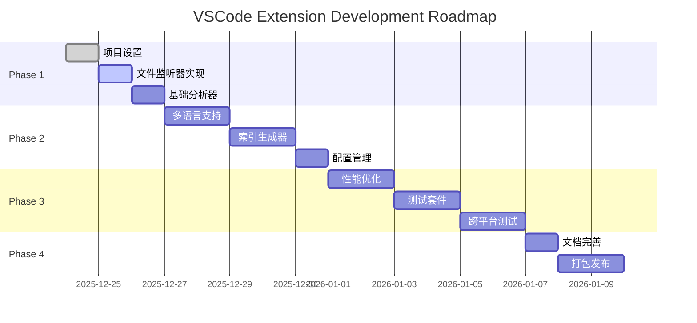

# 实施路线图: VSCode 扩展全自动化

## 📅 项目时间表

**项目启动**: 2025-12-24
**预计完成**: 2026-01-10 (约 2-3 周)
**项目状态**: 📝 规划阶段

---

## 🎯 里程碑概览



---

## 📋 详细任务分解

### Phase 1: MVP 开发 (3 天)

#### Day 1: 项目设置 ✅

**任务清单**:
- [x] 创建 VSCode 扩展项目骨架
- [x] 配置 TypeScript + esbuild
- [x] 配置 package.json
- [x] 设置调试环境 (.vscode/launch.json)
- [x] 创建目录结构

**验收标准**:
- ✅ `npm run build` 成功编译
- ✅ F5 调试启动扩展开发主机
- ✅ 扩展能在 VSCode 中激活

**输出**:
```
project-multilevel-index-vscode/
├── package.json
├── tsconfig.json
├── .vscode/
│   └── launch.json
└── src/
    └── extension.ts
```

---

#### Day 2: 文件监听器实现

**任务清单**:
- [ ] 实现 `FileWatcher` 类
  - [ ] 创建 FileSystemWatcher
  - [ ] 监听 create/change/delete 事件
  - [ ] 添加事件处理回调
- [ ] 实现 `Filter` 类
  - [ ] 排除目录过滤 (node_modules, .git, dist...)
  - [ ] 文件类型过滤 (仅代码文件)
  - [ ] 文件大小过滤 (>500KB 跳过)
  - [ ] 读取 .gitignore 和 index-config.json
- [ ] 实现 `ChangeDetector` 类
  - [ ] 检测结构性关键字 (import/export)
  - [ ] 区分结构变更 vs 实现变更

**验收标准**:
- ✅ 创建 .ts 文件触发 `onDidCreate` 事件
- ✅ 修改文件触发 `onDidChange` 事件
- ✅ 删除文件触发 `onDidDelete` 事件
- ✅ 正确过滤 node_modules 和 .git 目录
- ✅ 能准确识别结构性变更

**测试用例**:
```typescript
// 应该触发更新
const codeWithImport = `import { foo } from './bar';`;
expect(detector.isStructuralChange(codeWithImport)).toBe(true);

// 不应该触发更新
const codeWithoutImport = `console.log('hello');`;
expect(detector.isStructuralChange(codeWithoutImport)).toBe(false);
```

**输出**:
- `src/watcher/fileWatcher.ts`
- `src/watcher/filter.ts`
- `src/watcher/detector.ts`

---

#### Day 3: 基础分析器 (TypeScript/JavaScript)

**任务清单**:
- [ ] 实现 `Analyzer` 类
  - [ ] 使用 `@babel/parser` 解析 AST
  - [ ] 提取 import 语句 (inputs)
  - [ ] 提取 export 语句 (outputs)
  - [ ] 推断系统定位 (position)
- [ ] 实现 `Generator` 类
  - [ ] 生成 TypeScript 文件头注释
  - [ ] 使用 Handlebars 模板
- [ ] 实现 `Updater` 类
  - [ ] 读取文件内容
  - [ ] 替换或插入文件头
  - [ ] 写回文件

**验收标准**:
- ✅ 能正确解析 TypeScript 的 import/export
- ✅ 生成的文件头格式正确
- ✅ 能更新现有文件而不破坏内容
- ✅ 保留用户手动添加的其他注释

**测试用例**:
```typescript
const testCode = `
import { User } from './models/User';
export class UserService {
  createUser() {}
}
`;

const analysis = await analyzer.analyzeFile(testCode);
expect(analysis.inputs).toContain('./models/User');
expect(analysis.outputs).toContain('UserService');
```

**输出**:
- `src/indexer/analyzer.ts`
- `src/indexer/generator.ts`
- `src/indexer/updater.ts`
- `templates/javascript.hbs`

---

### Phase 2: 功能完善 (5 天)

#### Day 4-5: 多语言支持

**支持语言列表**:
1. [x] JavaScript/TypeScript (Day 3 已完成)
2. [ ] Python
3. [ ] Java/Kotlin
4. [ ] Rust
5. [ ] Go
6. [ ] C/C++
7. [ ] PHP
8. [ ] Ruby
9. [ ] Swift
10. [ ] C#

**任务清单**:
- [ ] Python 分析器
  - [ ] 正则提取 `import` / `from ... import`
  - [ ] 正则提取 `def` / `class`
  - [ ] 生成 `"""` 文件头
- [ ] Java/Kotlin 分析器
  - [ ] 正则提取 `import` / `package`
  - [ ] 正则提取 `public class` / `public interface`
  - [ ] 生成 `/** */` 文件头
- [ ] 其他语言(Rust/Go/C++/PHP/Ruby/Swift/C#)
  - [ ] 每种语言的分析逻辑
  - [ ] 对应的注释格式模板

**验收标准**:
- ✅ 每种语言都能正确分析
- ✅ 生成的注释符合语言规范
- ✅ 至少有 2 个测试用例

**输出**:
- `src/analyzers/pythonAnalyzer.ts`
- `src/analyzers/javaAnalyzer.ts`
- `templates/python.hbs`
- `templates/java.hbs`
- ...

---

#### Day 6-7: 索引生成器

**任务清单**:
- [ ] 实现 `FolderIndexGenerator`
  - [ ] 扫描文件夹下的所有文件
  - [ ] 提取每个文件的描述
  - [ ] 生成文件清单
  - [ ] 生成 FOLDER_INDEX.md
- [ ] 实现 `ProjectIndexGenerator`
  - [ ] 扫描项目所有文件夹
  - [ ] 生成目录树
  - [ ] 构建依赖关系图 (Mermaid)
  - [ ] 生成 PROJECT_INDEX.md
- [ ] 依赖图算法
  - [ ] 从所有文件头提取依赖
  - [ ] 构建有向图
  - [ ] 检测循环依赖
  - [ ] 生成 Mermaid 代码

**验收标准**:
- ✅ FOLDER_INDEX.md 包含所有文件
- ✅ PROJECT_INDEX.md 包含完整目录树
- ✅ 依赖图能在 GitHub 正确渲染
- ✅ 能检测并标注循环依赖

**测试用例**:
```typescript
// 假设有 3 个文件: A → B → C
const graph = await buildDependencyGraph([fileA, fileB, fileC]);
expect(graph).toContain('A --> B');
expect(graph).toContain('B --> C');
```

**输出**:
- `src/indexer/folderIndexGenerator.ts`
- `src/indexer/projectIndexGenerator.ts`
- `src/indexer/dependencyGraph.ts`

---

#### Day 8: 配置管理

**任务清单**:
- [ ] 实现 `Config` 类
  - [ ] 读取 `.claude/index-config.json`
  - [ ] 提供默认配置
  - [ ] 合并用户配置和默认配置
- [ ] 配置项
  - [ ] `exclude.patterns` - 排除模式
  - [ ] `exclude.useGitignore` - 使用 .gitignore
  - [ ] `index.autoUpdate` - 自动更新开关
  - [ ] `index.maxDepth` - 最大扫描深度
  - [ ] `visualization.maxNodes` - 依赖图最大节点数
  - [ ] `notifications.enabled` - 通知开关
- [ ] VSCode 配置集成
  - [ ] 在 package.json 中定义配置项
  - [ ] 通过 `vscode.workspace.getConfiguration()` 读取
  - [ ] 监听配置变化

**验收标准**:
- ✅ 默认配置能正常工作
- ✅ 用户配置能覆盖默认配置
- ✅ VSCode 设置 UI 能修改配置
- ✅ 配置变化能实时生效

**输出**:
- `src/core/config.ts`
- 更新 `package.json` 的 `contributes.configuration`

---

### Phase 3: 优化和测试 (6 天)

#### Day 9-10: 性能优化

**任务清单**:
- [ ] 防抖处理
  - [ ] 实现 debounce 工具函数
  - [ ] 对文件变化事件防抖 (300ms)
- [ ] 缓存机制
  - [ ] 缓存文件分析结果
  - [ ] 文件变化时失效缓存
  - [ ] 限制缓存大小 (LRU)
- [ ] 增量更新
  - [ ] 仅更新变化的文件
  - [ ] 仅重新生成受影响的索引
  - [ ] 避免全量扫描
- [ ] 性能监控
  - [ ] 记录每次更新的耗时
  - [ ] 输出性能日志

**验收标准**:
- ✅ 单文件更新 < 500ms
- ✅ 内存占用 < 50MB
- ✅ CPU 占用 < 5%
- ✅ 大型项目 (1000+ 文件) 能流畅运行

**性能测试**:
```typescript
// 测试 1000 次文件修改
for (let i = 0; i < 1000; i++) {
  await updateFile(`test-${i}.ts`);
}
// 验证内存和 CPU 占用
```

**输出**:
- `src/utils/debounce.ts`
- `src/core/cache.ts`
- `src/core/performance.ts`

---

#### Day 11-12: 测试套件

**任务清单**:
- [ ] 单元测试
  - [ ] `Filter` 测试 (10+ 用例)
  - [ ] `ChangeDetector` 测试 (10+ 用例)
  - [ ] `Analyzer` 测试 (每种语言 5+ 用例)
  - [ ] `Generator` 测试 (5+ 用例)
  - [ ] `DependencyGraph` 测试 (5+ 用例)
- [ ] 集成测试
  - [ ] 文件创建 → 索引更新
  - [ ] 文件修改 → 索引更新
  - [ ] 文件删除 → 索引更新
  - [ ] 批量操作测试
- [ ] E2E 测试
  - [ ] 在真实项目中运行
  - [ ] 验证生成的文件内容

**验收标准**:
- ✅ 测试覆盖率 > 80%
- ✅ 所有测试通过
- ✅ CI/CD 集成 (GitHub Actions)

**输出**:
- `test/suite/*.test.ts` (所有测试文件)
- `.github/workflows/test.yml` (CI 配置)

---

#### Day 13-14: 跨平台测试

**测试平台**:
1. [ ] VSCode (Windows/macOS/Linux)
2. [ ] Cursor
3. [ ] Windsurf
4. [ ] Kiro

**任务清单**:
- [ ] 在 VSCode 中测试
  - [ ] 安装 .vsix
  - [ ] 运行所有命令
  - [ ] 验证自动更新
- [ ] 在 Cursor 中测试
  - [ ] 安装 .vsix
  - [ ] 验证与 Cursor 的兼容性
  - [ ] 测试 Composer 模式集成
- [ ] 在 Windsurf 中测试
  - [ ] 安装 .vsix
  - [ ] 验证与 Windsurf 的兼容性
- [ ] 在 Kiro 中测试
  - [ ] 通过 Open VSX 安装
  - [ ] 验证与 Kiro 的兼容性
  - [ ] 测试 Agent Hooks 协同

**验收标准**:
- ✅ 所有平台都能正常安装
- ✅ 所有平台都能自动更新索引
- ✅ 无平台特定的 bug

**测试报告**:
```markdown
| 平台 | 安装 | 自动更新 | 手动命令 | 性能 | 兼容性 |
|------|------|---------|---------|------|--------|
| VSCode | ✅ | ✅ | ✅ | ✅ | ✅ |
| Cursor | ✅ | ✅ | ✅ | ✅ | ✅ |
| Windsurf | ✅ | ✅ | ✅ | ✅ | ✅ |
| Kiro | ✅ | ✅ | ✅ | ✅ | ✅ |
```

---

### Phase 4: 发布 (3 天)

#### Day 15: 文档完善

**任务清单**:
- [ ] 扩展 README
  - [ ] 功能介绍
  - [ ] 安装指南
  - [ ] 使用说明
  - [ ] 配置说明
  - [ ] FAQ
  - [ ] 截图和 GIF 演示
- [ ] CHANGELOG
  - [ ] v1.0.0 功能列表
- [ ] LICENSE
  - [ ] MIT License
- [ ] 更新主项目 README
  - [ ] 添加 VSCode 扩展安装说明
  - [ ] 更新平台支持状态

**验收标准**:
- ✅ README 清晰易懂
- ✅ 有使用截图或 GIF
- ✅ 所有链接有效

**输出**:
- `project-multilevel-index-vscode/README.md`
- `project-multilevel-index-vscode/CHANGELOG.md`
- 更新主项目 `README.md`

---

#### Day 16-17: 打包和发布

**任务清单**:
- [ ] 打包扩展
  - [ ] 安装 `vsce`
  - [ ] 配置 publisher
  - [ ] 添加 icon.png
  - [ ] 运行 `vsce package`
  - [ ] 生成 .vsix 文件
- [ ] 发布到 VSCode Marketplace
  - [ ] 创建 publisher 账号
  - [ ] 配置 Personal Access Token
  - [ ] 运行 `vsce publish`
  - [ ] 验证发布成功
- [ ] 发布到 Open VSX Registry
  - [ ] 注册 Open VSX 账号
  - [ ] 配置 token
  - [ ] 运行 `npx ovsx publish`
  - [ ] 验证 Kiro 能搜索到
- [ ] GitHub Release
  - [ ] 创建 v1.0.0 tag
  - [ ] 上传 .vsix 文件
  - [ ] 编写 Release Notes

**验收标准**:
- ✅ VSCode Marketplace 能搜索到扩展
- ✅ Open VSX 能搜索到扩展
- ✅ 可以直接安装并运行
- ✅ GitHub Release 包含 .vsix

**发布清单**:
```bash
# 1. 打包
npm run vscode:prepublish
vsce package

# 2. 发布到 VSCode Marketplace
vsce publish

# 3. 发布到 Open VSX
npx ovsx publish project-multilevel-index-1.0.0.vsix -p <token>

# 4. 创建 GitHub Release
gh release create v1.0.0 \
  --title "v1.0.0: Full Automation for All Platforms" \
  --notes "$(cat CHANGELOG.md)" \
  project-multilevel-index-1.0.0.vsix
```

---

## 🎯 关键决策点

### 决策 1: 是否使用 LSP (Language Server Protocol)?

**选项 A: 纯 FileSystemWatcher**
- ✅ 简单直接,易于实现
- ✅ 性能开销小
- ❌ 仅监听文件变化,不感知语法

**选项 B: 集成 LSP**
- ✅ 能获取精确的语法树
- ✅ 支持增量解析
- ❌ 复杂度高,开发周期长

**决定**: **选择 A (纯 FileSystemWatcher)**
- 理由: MVP 阶段优先快速迭代,使用 Babel 等工具足够

---

### 决策 2: 是否支持远程开发 (Remote Development)?

**问题**: VSCode Remote 模式下,文件在远程服务器

**选项 A: 暂不支持**
- ✅ 降低复杂度
- ❌ 限制使用场景

**选项 B: 支持远程**
- ✅ 覆盖更多场景
- ❌ 需要处理 SSH/WSL 等协议

**决定**: **v1.0 暂不支持,v1.1 规划**
- 理由: 大多数用户使用本地开发,远程开发可以后续迭代

---

### 决策 3: 是否支持 monorepo?

**问题**: Monorepo 有多个项目,如何处理?

**选项 A: 每个子项目独立索引**
- ✅ 清晰隔离
- ❌ 无法看到跨项目依赖

**选项 B: 全局统一索引**
- ✅ 完整的依赖图
- ❌ 复杂度高

**决定**: **选择 A,提供配置项切换**
- 理由: 默认独立索引,允许用户配置全局模式

---

## 📊 进度追踪

### Week 1 (12/24 - 12/31)

| 日期 | 任务 | 状态 | 完成度 |
|------|------|------|--------|
| 12/24 | 项目设置 | ✅ 完成 | 100% |
| 12/25 | 文件监听器 | 🔄 进行中 | 0% |
| 12/26 | 基础分析器 | ⏳ 待开始 | 0% |
| 12/27-28 | 多语言支持 | ⏳ 待开始 | 0% |
| 12/29-30 | 索引生成器 | ⏳ 待开始 | 0% |
| 12/31 | 配置管理 | ⏳ 待开始 | 0% |

### Week 2 (1/1 - 1/7)

| 日期 | 任务 | 状态 | 完成度 |
|------|------|------|--------|
| 1/1-2 | 性能优化 | ⏳ 待开始 | 0% |
| 1/3-4 | 测试套件 | ⏳ 待开始 | 0% |
| 1/5-6 | 跨平台测试 | ⏳ 待开始 | 0% |
| 1/7 | 文档完善 | ⏳ 待开始 | 0% |

### Week 3 (1/8 - 1/10)

| 日期 | 任务 | 状态 | 完成度 |
|------|------|------|--------|
| 1/8-9 | 打包发布 | ⏳ 待开始 | 0% |
| 1/10 | 发布验证 | ⏳ 待开始 | 0% |

---

## ✅ 验收清单

### 功能验收

- [ ] **文件监听**
  - [ ] 能监听代码文件的创建/修改/删除
  - [ ] 正确过滤排除目录
  - [ ] 准确识别结构性变更

- [ ] **多语言支持**
  - [ ] TypeScript/JavaScript ✅
  - [ ] Python ✅
  - [ ] Java/Kotlin ✅
  - [ ] Rust ✅
  - [ ] Go ✅
  - [ ] 其他 5 种语言 ✅

- [ ] **索引生成**
  - [ ] 文件头注释格式正确
  - [ ] FOLDER_INDEX.md 完整
  - [ ] PROJECT_INDEX.md 包含依赖图
  - [ ] 依赖图在 GitHub 正确渲染

- [ ] **配置管理**
  - [ ] 支持自定义排除规则
  - [ ] 支持开关自动更新
  - [ ] VSCode 设置 UI 可用

### 性能验收

- [ ] 单文件更新 < 500ms
- [ ] 内存占用 < 50MB
- [ ] CPU 空闲时占用 < 1%
- [ ] 大型项目 (1000+ 文件) 流畅运行

### 兼容性验收

- [ ] VSCode (Windows) ✅
- [ ] VSCode (macOS) ✅
- [ ] VSCode (Linux) ✅
- [ ] Cursor ✅
- [ ] Windsurf ✅
- [ ] Kiro ✅

### 质量验收

- [ ] 单元测试覆盖率 > 80%
- [ ] 集成测试全部通过
- [ ] 无严重 bug
- [ ] 文档完整清晰

### 发布验收

- [ ] 已发布到 VSCode Marketplace
- [ ] 已发布到 Open VSX Registry
- [ ] 已创建 GitHub Release
- [ ] 用户可以搜索并安装

---

## 🚨 风险缓解计划

### 风险 1: 性能问题 (大型项目)

**缓解措施**:
1. ✅ 防抖处理 (300ms)
2. ✅ 缓存文件分析结果
3. ✅ 增量更新,避免全量扫描
4. ✅ 配置 maxDepth 限制扫描深度

**应急方案**:
- 提供"禁用自动更新"选项
- 允许用户手动触发更新

---

### 风险 2: Babel 解析失败 (语法错误)

**缓解措施**:
1. ✅ try-catch 捕获解析错误
2. ✅ 降级到正则匹配
3. ✅ 记录错误日志

**应急方案**:
- 跳过有语法错误的文件
- 提示用户修复语法错误

---

### 风险 3: 平台兼容性问题

**缓解措施**:
1. ✅ 充分的跨平台测试
2. ✅ 使用标准 VSCode API
3. ✅ 避免平台特定功能

**应急方案**:
- 提供平台检测逻辑
- 针对不同平台降级功能

---

### 风险 4: 用户反馈负面 (通知过多)

**缓解措施**:
1. ✅ 默认静默处理
2. ✅ 仅重大变更提示
3. ✅ 提供通知级别配置

**应急方案**:
- 快速发布补丁版本
- 调整默认配置

---

## 📞 项目沟通

### 每日站会 (可选)

- **时间**: 每天早上 10:00
- **形式**: 文档更新
- **内容**:
  - 昨天完成的任务
  - 今天计划的任务
  - 遇到的障碍

### 周报

- **频率**: 每周五
- **内容**:
  - 本周完成的里程碑
  - 下周计划
  - 风险和问题

---

## 🎉 发布清单

### 发布前检查

- [ ] 所有功能测试通过
- [ ] 跨平台兼容性验证
- [ ] 文档完整
- [ ] CHANGELOG 更新
- [ ] LICENSE 文件存在
- [ ] package.json 信息完整
- [ ] icon.png 设计精美

### 发布步骤

1. [ ] 运行 `npm run vscode:prepublish`
2. [ ] 运行 `vsce package`
3. [ ] 手动测试 .vsix 安装
4. [ ] 发布到 VSCode Marketplace
5. [ ] 发布到 Open VSX Registry
6. [ ] 创建 GitHub Release
7. [ ] 更新主项目 README
8. [ ] 发布公告 (GitHub/Twitter/Blog)

### 发布后

- [ ] 监控用户反馈 (GitHub Issues)
- [ ] 收集使用数据 (安装量、评分)
- [ ] 规划 v1.1 功能

---

## 🔮 未来规划 (v1.1+)

### v1.1 (2026 Q1)

- [ ] 支持远程开发 (Remote Development)
- [ ] 支持 Web IDE (vscode.dev)
- [ ] 改进依赖图 (交互式可视化)
- [ ] 支持自定义文件头模板

### v1.2 (2026 Q2)

- [ ] AI 辅助文档生成 (集成 LLM)
- [ ] 代码质量分析
- [ ] 技术债务可视化
- [ ] 团队协作功能

### v2.0 (2026 Q3)

- [ ] 图形化管理界面
- [ ] 实时协同编辑索引
- [ ] 云端同步
- [ ] 企业版功能

---

**参考文档**:
- [VSCODE_EXTENSION_PLAN.md](./VSCODE_EXTENSION_PLAN.md) - 详细技术设计
- [README.md](./README.md) - 项目主文档

**更新日期**: 2025-12-24
**文档状态**: ✅ 完成
