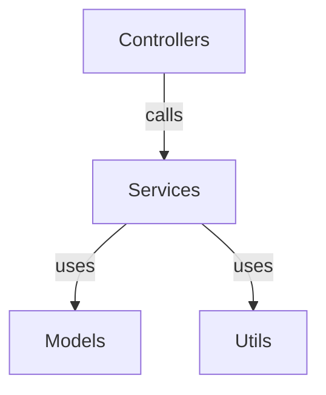

# Project Multi-level Index System

<div align="center">

> A Fractal Self-Referential Documentation System Inspired by "Gödel, Escher, Bach"
>
> Making code projects self-referential, self-maintaining, and harmoniously elegant like a fugue

[](https://github.com/Claudate/project-multilevel-index/releases)
[](I18N_GUIDE.md)
[](LICENSE)
[](https://claude.ai/code)
[](CONTRIBUTING.md)

**🌐 Multi-Platform Code Documentation Automation System**

CLI Tool + Claude Code Plugin + VSCode Extension (In Development)

[English](#) | [简体中文](README.md) | [📖 Documentation](#-documentation-navigation)

</div>

---

## 📖 Core Concept

**Three-Level Fractal Documentation System** - Automatically maintains project indexes and dependencies:

```
PROJECT_INDEX.md (Root Index)
  ├─ Project overview & architecture
  ├─ Directory structure
  └─ Mermaid dependency graph

Each Folder/
  └─ FOLDER_INDEX.md (Folder Index)
       ├─ Architecture description
       ├─ File manifest
       └─ "Update me when this folder changes"

Each File
  └─ File Header Comment
       ├─ Input: What it depends on
       ├─ Output: What it provides
       ├─ Pos: Position in the system
       └─ "Update me and my indices when I change"
```

### Three Core Principles

- **🔄 Self-Similarity**: Each level has the same index structure
- **🪞 Self-Reference**: Each document declares "update me when I change"
- **🎼 Polyphony**: Code and documentation echo each other; local changes affect the whole

---

## 🚀 Quick Start

### Method 1: CLI Tool `codex` (Recommended for CI/CD)

**Standalone command-line tool** - Works independently of any editor:

```bash
# 1. Clone and install
git clone https://github.com/Claudate/project-multilevel-index.git
cd project-multilevel-index/cli
npm install && npm run build && npm link

# 2. Use it
cd /your/project
codex init
```

**Output Example**:
```
🎼 Fractal Multi-level Index System
✔ Found 45 code files
✔ Generated 45 file headers
✔ Generated 8 folder indexes
✔ Generated PROJECT_INDEX.md
✅ Index system initialized successfully!
```

📖 [CLI Full Documentation](cli/README.md) | [Implementation Details](CLI_IMPLEMENTATION.md)

---

### Method 2: Claude Code Plugin (Recommended for Claude Code)

**Easiest installation**:

```bash
/plugin marketplace add Claudate/project-multilevel-index
/plugin install project-multilevel-index
```

**Usage**:

```bash
# Initialize index
/project-multilevel-index:init-index

# Auto-update (Hook triggers automatically)
# Indexes auto-update when you modify code
```

📖 [Installation Guide](INSTALL_GUIDE.md) | [Quick Start](QUICKSTART.md)

---

### Method 3: VSCode Extension (In Development)

**Full automation solution** - Expected release: 2026-01-10

Supported platforms:
- ✅ VSCode
- ✅ Cursor
- ✅ Windsurf
- ✅ Kiro

📖 [Technical Design](VSCODE_EXTENSION_PLAN.md) | [Development Roadmap](IMPLEMENTATION_ROADMAP.md)

---

## ⭐ Core Features

### 🤖 Automated Indexing

- ✅ **Auto-scan**: Recursively scan all code files in project
- ✅ **Smart Analysis**: AST or regex-based dependency analysis
- ✅ **Auto-generate**: File headers + folder indexes + project index
- ✅ **Auto-update**: Update related indexes when files change (Claude Code)

### 🌍 10+ Programming Languages

JavaScript/TypeScript • Python • Java/Kotlin • Rust • Go
C/C++ • PHP • Ruby • Swift • C#

📖 [File Header Examples](FILE_HEADERS.md)

### 📊 Dependency Visualization



Auto-generate Mermaid dependency graphs, supporting:
- GitHub
- VSCode (Mermaid extension)
- Obsidian
- Any Markdown viewer

---

## 📚 Command Quick Reference

| Command | Function |
|---------|----------|
| [`init-index`](COMMANDS.md#1-init-index---initialize-index-system) | Initialize index system |
| [`update-index`](COMMANDS.md#2-update-index---update-index) | Manual index update |
| [`check-index`](COMMANDS.md#3-check-index---consistency-check) | Consistency check |
| [`set-language`](COMMANDS.md#4-set-language---switch-language) | Switch language |

> **💡 Tip**: Claude Code commands require prefix `/project-multilevel-index:`

📖 [Command Details](COMMANDS.md)

---

## 🎯 Use Cases

Check **[USE_CASES.md](USE_CASES.md)** for 8 real-world application scenarios:

1. **Open Source Project Documentation** - Lower contribution barrier
2. **Enterprise Microservices** - Architecture visualization
3. **Personal Learning Projects** - Track growth process
4. **Technical Debt Refactoring** - Track refactoring progress
5. **API Design Review** - API endpoint inventory at a glance
6. **Multi-Team Collaboration** - Avoid duplicate development
7. **Code Review Assistance** - Quickly understand change impact
8. **Technical Documentation** - Auto-generate API docs

---

## 🗺️ Platform Support

| Platform | Automation | Status | Documentation |
|----------|-----------|--------|--------------|
| **CLI Tool** | Manual command | ✅ Released | [CLI README](cli/README.md) |
| **Claude Code** | Full Auto | ✅ Released | [Install Guide](INSTALL_GUIDE.md) |
| **VSCode Extension** | Full Auto | 🚧 In Dev | [Technical Design](VSCODE_EXTENSION_PLAN.md) |
| **Rules-based** | Semi-Auto | ✅ Available | [Cursor](examples/cursor-example/) \| [Windsurf](examples/windsurf-example/) \| [Kiro](examples/kiro-example/) |

📖 [Platform Comparison](PLATFORM_SUPPORT.md)

---

## 📖 Documentation Navigation

### Quick Start
- [Installation Guide](INSTALL_GUIDE.md) - Detailed installation steps
- [Quick Start](QUICKSTART.md) - Get started in 5 minutes
- [Usage Examples](EXAMPLES.md) - Complete usage examples

### Core Documentation
- [Command Reference](COMMANDS.md) - Detailed command descriptions
- [Platform Support](PLATFORM_SUPPORT.md) - Platform comparison and selection
- [File Header Examples](FILE_HEADERS.md) - File header templates for 10+ languages

### Advanced Topics
- [I18N Guide](I18N_GUIDE.md) - Language switching and configuration
- [Use Cases](USE_CASES.md) - 8 real-world application scenarios
- [Demo Script](DEMO_SCRIPT.md) - Complete demo recording guide

### Developers
- [Contributing Guide](CONTRIBUTING.md) - How to contribute
- [CLI Implementation](CLI_IMPLEMENTATION.md) - CLI tool technical details
- [VSCode Extension Plan](VSCODE_EXTENSION_PLAN.md) - VSCode extension technical design
- [Development Roadmap](IMPLEMENTATION_ROADMAP.md) - Overall development progress

---

## 📝 File Header Examples

### TypeScript
```typescript
/**
 * Input: express, bcrypt, ./models/User
 * Output: router, POST /login, POST /register
 * Pos: API Layer - Authentication routes
 *
 * This comment auto-updates when file is modified
 */
```

### Python
```python
"""
Input: flask, sqlalchemy, .models.User
Output: UserController class, /api/users routes
Pos: API Layer - User controller for HTTP requests

This comment auto-updates when file is modified
"""
```

📖 [View All Language Examples](FILE_HEADERS.md)

---

## 🎬 Complete Example Projects

We provide complete example projects for three platforms:

- **[Cursor Example](examples/cursor-example/)** - Full TypeScript project
- **[Windsurf Example](examples/windsurf-example/)** - Windsurf configuration
- **[Kiro Example](examples/kiro-example/)** - Kiro configuration

Each example includes:
- ✅ Complete project structure (Controllers/Services/Models/Utils)
- ✅ Pre-configured rule files
- ✅ Generated index files
- ✅ Detailed usage instructions

---

## 💬 Community & Support

### WeChat Group

Scan the QR code to join our WeChat group:

<div align="center">


</div>

📖 [More Community Resources](COMMUNITY.md)

### GitHub

- 📋 [Issues](https://github.com/Claudate/project-multilevel-index/issues) - Report issues
- 💬 [Discussions](https://github.com/Claudate/project-multilevel-index/discussions) - Q&A and discussions
- 🤝 [Contributing](CONTRIBUTING.md) - Contribution guidelines

---

## 🎓 Inspiration

Inspired by Douglas Hofstadter's "Gödel, Escher, Bach: An Eternal Golden Braid":

- **Self-Reference**: Documents point to themselves, declaring "update me"
- **Recursion**: Index of indexes of indexes...
- **Strange Loop**: Code → Documentation → Code infinite loop
- **Fractal**: Each level is a miniature of the whole

**Let your code projects become like fugues – self-referential, self-maintaining, elegantly harmonious!** 🎼

---

## 📜 License

MIT License - Free to use, modify, and distribute

---

<div align="center">

**Start with `/project-multilevel-index:init-index` to experience the fractal documentation system!** 🚀

[⬆️ Back to Top](#project-multi-level-index-system)

</div>
