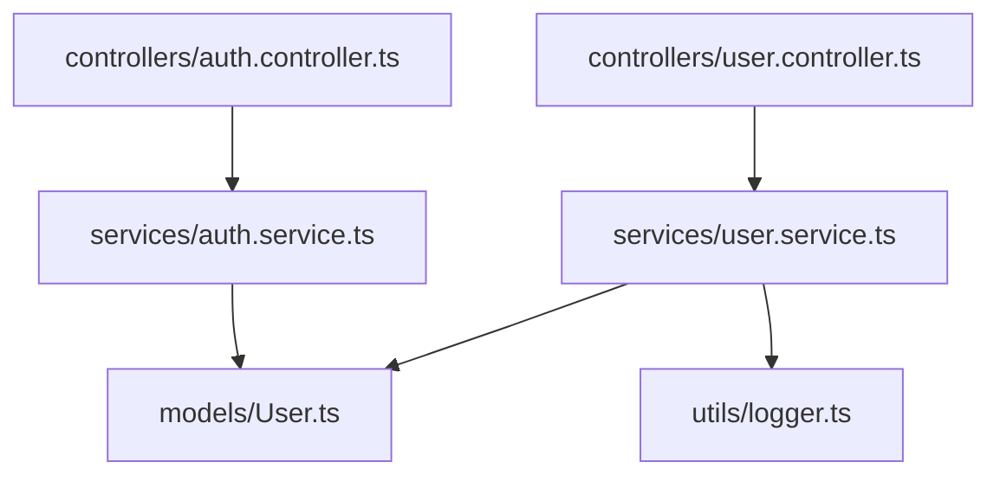

# Cursor 示例项目

这是一个演示如何在 Cursor 中使用分形多级索引系统的完整示例项目。

## 项目结构

```
cursor-example/
├── .cursor/
│   ├── rules/
│   │   ├── doc-maintenance.md       # 主规则文件
│   │   └── index-system-prompt.md   # 索引系统说明
│   └── index-config.json            # 配置文件
├── .cursorrules                      # 全局规则
├── src/
│   ├── controllers/
│   │   ├── FOLDER_INDEX.md
│   │   ├── user.controller.ts
│   │   └── auth.controller.ts
│   ├── services/
│   │   ├── FOLDER_INDEX.md
│   │   ├── user.service.ts
│   │   └── auth.service.ts
│   ├── models/
│   │   ├── FOLDER_INDEX.md
│   │   └── User.ts
│   └── utils/
│       ├── FOLDER_INDEX.md
│       └── logger.ts
├── PROJECT_INDEX.md                  # 项目根索引
└── README.md                         # 本文件
```

## 快速开始

### 1. 打开项目

在 Cursor 中打开此示例项目:

```bash
cursor examples/cursor-example
```

### 2. 查看配置

Cursor 会自动读取以下配置:

- [.cursorrules](.cursorrules) - 全局规则
- [.cursor/rules/doc-maintenance.md](.cursor/rules/doc-maintenance.md) - 文档维护规则

### 3. 查看索引结构

查看已生成的索引文件:

- [PROJECT_INDEX.md](PROJECT_INDEX.md) - 项目根索引
- [src/controllers/FOLDER_INDEX.md](src/controllers/FOLDER_INDEX.md) - 控制器索引
- [src/services/FOLDER_INDEX.md](src/services/FOLDER_INDEX.md) - 服务索引

### 4. 测试自动更新

在 Cursor Chat 中尝试以下操作:

#### 测试 1: 添加新依赖

```
请在 src/services/user.service.ts 中添加一个新的导入:
import { EmailService } from './email.service';
```

**期望结果**: AI 应该:
1. 检测到结构性变更
2. 更新 user.service.ts 的文件头注释
3. 更新 src/services/FOLDER_INDEX.md
4. 更新 PROJECT_INDEX.md 的依赖图

#### 测试 2: 创建新文件

```
请创建 src/services/email.service.ts，实现邮件发送功能
```

**期望结果**: AI 应该:
1. 创建文件并添加文件头注释
2. 将文件添加到 src/services/FOLDER_INDEX.md
3. 更新 PROJECT_INDEX.md

#### 测试 3: 修改实现细节

```
请修改 src/services/user.service.ts 中 createUser 方法的实现，添加日志
```

**期望结果**: AI 应该:
- 仅修改代码，**不更新索引** (因为不是结构性变更)

### 5. 手动触发更新

如果 AI 没有主动更新，可以手动提醒:

```
请检查并更新索引系统
```

或更明确地:

```
我修改了 user.service.ts，请根据 .cursor/rules/doc-maintenance.md 更新索引
```

### 6. 检查一致性

定期检查索引一致性:

```
请检查索引系统的一致性
```

**期望输出**:
```
索引一致性检查报告
==================

✅ 文件头完整性: 6/6
✅ 文件夹索引: 4/4
✅ 依赖关系: 正常
✅ 索引结构: 符合规范

所有检查通过!
```

## 工作流程说明

### 自动更新流程

```
用户修改代码
    ↓
Cursor AI 读取 .cursor/rules/doc-maintenance.md
    ↓
检测变更类型 (结构性 vs 实现)
    ↓
如果是结构性变更:
    ├─ 分析 Input/Output/Pos
    ├─ 更新文件头注释
    ├─ 更新 FOLDER_INDEX.md
    └─ 更新 PROJECT_INDEX.md
    ↓
输出简短确认消息
```

### 手动更新流程

```
用户提醒 AI
    ↓
AI 读取规则文件
    ↓
AI 扫描项目中的所有代码文件
    ↓
AI 批量更新索引
    ↓
输出更新报告
```

## 示例代码说明

### 文件头注释示例

查看 [src/services/user.service.ts](src/services/user.service.ts) 的文件头:

```typescript
/**
 * Input: User, CreateUserDTO from models/User, Logger from utils/logger
 * Output: UserService class, createUser/findById/findAll methods
 * Pos: Service Layer - User domain service, orchestrates business logic
 *
 * 🔄 Self-reference: When this file changes, update:
 * - This file header
 * - src/services/FOLDER_INDEX.md
 * - PROJECT_INDEX.md
 */
```

**说明**:
- **Input**: 列出所有导入的依赖
- **Output**: 列出所有导出的内容
- **Pos**: 描述在系统中的定位
- **Self-reference**: 自指性声明

### FOLDER_INDEX 示例

查看 [src/services/FOLDER_INDEX.md](src/services/FOLDER_INDEX.md):

```markdown
## 📁 services/

**架构说明** (3行):
- 业务服务层，处理业务逻辑
- 调用数据层和外部 API
- 被控制层调用

**文件清单**:
- `user.service.ts` - 用户管理服务
- `auth.service.ts` - 认证服务

🔄 **自指**: 当此文件夹中的文件变化时，更新本索引和 PROJECT_INDEX.md
```

### PROJECT_INDEX 示例

查看 [PROJECT_INDEX.md](PROJECT_INDEX.md) 中的 Mermaid 依赖图:



## 配置选项

编辑 [.cursor/index-config.json](.cursor/index-config.json) 自定义行为:

```json
{
  "autoUpdate": true,
  "maxFileSize": 524288,
  "excludePatterns": ["node_modules", ".git", "dist", "build"],
  "language": "zh-CN",
  "silentMode": true,
  "generateMermaid": true,
  "maxMermaidNodes": 50
}
```

**选项说明**:
- `autoUpdate`: 是否自动更新 (Cursor 中依赖 AI 理解)
- `maxFileSize`: 最大文件大小 (字节)
- `excludePatterns`: 排除的目录模式
- `language`: 界面语言 (zh-CN 或 en-US)
- `silentMode`: 是否静默处理
- `generateMermaid`: 是否生成 Mermaid 图
- `maxMermaidNodes`: Mermaid 图最大节点数

## 常见问题

### Q1: AI 没有自动更新索引怎么办?

**A**: Cursor 不支持完全自动化，需要手动提醒。尝试:

```
请根据规则更新索引
我修改了代码，请更新文档
检查并更新索引系统
```

### Q2: 如何提高自动化程度?

**A**:
1. 在对话开始时明确告诉 AI: "请遵守 .cursor/rules/ 中的规则"
2. 使用 Composer 模式进行多文件编辑
3. 定期提醒 AI 注意文档维护

### Q3: @文件引用不工作怎么办?

**A**: 修改规则文件，使用明确的路径:

```markdown
参考文件: `universal/core/analyzer/dependency-parser.md`
请读取并理解该文件的内容。
```

### Q4: 如何切换语言?

**A**: 编辑 `.cursor/index-config.json`:

```json
{
  "language": "en-US"
}
```

或在对话中:

```
请将索引系统切换为英文
```

## 最佳实践

### 1. 在开始对话时设定规则

```
你好! 在这个项目中，请遵守 .cursor/rules/doc-maintenance.md 中的文档维护规则。
```

### 2. 定期检查一致性

每周或每次大改动后:

```
请检查索引系统的一致性，并修复发现的问题
```

### 3. 使用 Composer 模式

对于多文件修改，使用 Cursor Composer:
- 打开 Composer (Cmd/Ctrl + I)
- 提出多文件修改需求
- AI 更容易理解整体变更

### 4. 清晰的提交消息

配合 Git 使用时，在提交消息中提及索引更新:

```
feat: add email service

- Created email.service.ts
- Updated user.service to use email service
- Updated index system (auto)
```

## 演示视频

参考 [demo.gif](demo.gif) 查看完整演示。

## 下一步

- 查看 [Windsurf 示例](../windsurf-example/README.md)
- 查看 [Kiro 示例](../kiro-example/README.md)
- 阅读 [使用案例文档](../../USE_CASES.md)

## 反馈与贡献

如果遇到问题或有改进建议:
- 提交 Issue: https://github.com/Claudate/project-multilevel-index/issues
- 参与讨论: https://github.com/Claudate/project-multilevel-index/discussions
