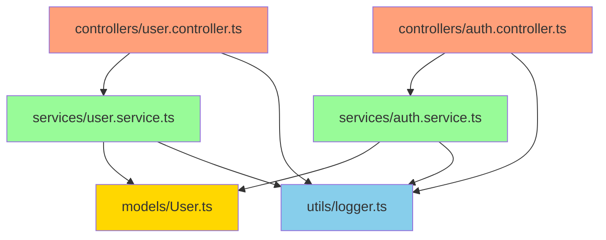

# 项目索引 - Cursor 示例项目

## 项目概览

这是一个使用分形多级索引系统的示例项目,演示了经典的三层架构:

- **API 层** (controllers): 处理 HTTP 请求
- **业务层** (services): 处理业务逻辑
- **数据层** (models): 定义数据结构

**技术栈**: TypeScript, Node.js

**架构模式**: 分层架构 + 依赖注入

---

## 目录结构

```
cursor-example/
├── src/
│   ├── controllers/     (2 files) - API 层
│   ├── services/        (2 files) - 业务层
│   ├── models/          (1 file)  - 数据层
│   └── utils/           (1 file)  - 工具层
├── .cursor/
│   └── rules/           - Cursor 规则配置
├── PROJECT_INDEX.md     (本文件)
└── README.md
```

---

## 依赖关系图



---

## 文件清单

### 📁 controllers/ (API 层)
- [user.controller.ts](src/controllers/user.controller.ts) - 用户 HTTP 控制器
- [auth.controller.ts](src/controllers/auth.controller.ts) - 认证 HTTP 控制器

### 📁 services/ (业务层)
- [user.service.ts](src/services/user.service.ts) - 用户管理服务
- [auth.service.ts](src/services/auth.service.ts) - 认证服务

### 📁 models/ (数据层)
- [User.ts](src/models/User.ts) - 用户领域模型

### 📁 utils/ (工具层)
- [logger.ts](src/utils/logger.ts) - 日志工具

---

## 架构说明

### 分层架构

本项目采用经典的分层架构:

1. **Controllers** → 处理 HTTP 请求,调用 Services
2. **Services** → 处理业务逻辑,调用 Models
3. **Models** → 定义数据结构
4. **Utils** → 提供通用工具

### 依赖流向

- ✅ Controllers → Services → Models (合理)
- ✅ 所有层 → Utils (合理)
- ❌ 禁止反向依赖 (Models → Services)
- ❌ 禁止跨层依赖 (Controllers → Models)

### 自指性

每个层级都声明"当我变化时,更新我":
- **文件头注释** → 声明更新自己、FOLDER_INDEX 和 PROJECT_INDEX
- **FOLDER_INDEX** → 声明更新自己和 PROJECT_INDEX
- **PROJECT_INDEX** → 声明更新自己

这形成了一个自我维护的文档系统。

---

## 使用示例

### 1. 创建用户流程

```
HTTP Request
    ↓
UserController.handleCreateUser()
    ↓
UserService.createUser()
    ↓
创建 User 对象
    ↓
Logger.info() - 记录日志
    ↓
返回 User 对象
```

### 2. 登录流程

```
HTTP Request
    ↓
AuthController.handleLogin()
    ↓
AuthService.login()
    ↓
验证凭证
    ↓
生成 Token
    ↓
Logger.info() - 记录日志
    ↓
返回 Token
```

---

## 扩展建议

如需扩展此项目,建议按以下顺序:

1. **添加新模型** → 在 `models/` 中创建
2. **添加新服务** → 在 `services/` 中创建,使用新模型
3. **添加新控制器** → 在 `controllers/` 中创建,调用新服务
4. **索引会自动更新** → 根据 Cursor 规则自动维护

---

## 循环依赖检测

✅ **无循环依赖**

所有依赖都是单向的,符合分层架构原则。

---

🔄 **自指**: 当项目结构变化时,更新本索引

**最后更新**: 2025-12-24
**文件总数**: 6
**依赖边数**: 8
