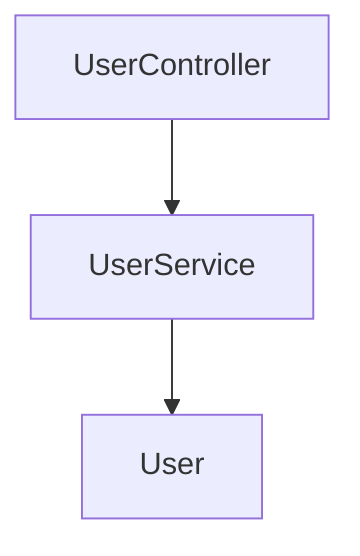

# Project Multilevel Index - VSCode Extension

🎼 Fractal self-referential documentation system for VSCode, Cursor, Windsurf, and Kiro.

## Features

- **✨ Automatic Index Generation**: Auto-maintains file headers, folder indexes, and project dependency graphs
- **🔄 Real-time Updates**: Monitors file changes and updates indexes automatically
- **📊 Dependency Visualization**: Generates Mermaid dependency graphs
- **🌍 Multi-language Support**: TypeScript, JavaScript, Python, Java, Rust, Go, C/C++, PHP, Ruby, Swift, C#
- **⚙️ Highly Configurable**: Customize via VSCode settings or config file

## Installation

### From VSCode Marketplace

1. Open VSCode/Cursor/Windsurf/Kiro
2. Press `Ctrl+P` (Windows/Linux) or `Cmd+P` (macOS)
3. Type: `ext install Claudate.project-multilevel-index`
4. Press Enter

### From VSIX File

```bash
code --install-extension project-multilevel-index-0.1.0.vsix
```

## Quick Start

1. **Initialize Index System**
   - Open Command Palette (`Ctrl+Shift+P` / `Cmd+Shift+P`)
   - Run: `Project Index: Initialize Index System`

2. **Auto-update is Enabled by Default**
   - Edit any code file
   - Index updates automatically!

3. **Manual Update** (Optional)
   - Command: `Project Index: Update All Indexes`

4. **Check Consistency** (Optional)
   - Command: `Project Index: Check Index Consistency`

## Configuration

### VSCode Settings

```json
{
  "projectMultilevelIndex.autoUpdate": true,
  "projectMultilevelIndex.exclude.patterns": [
    "**/node_modules/**",
    "**/.git/**",
    "**/dist/**"
  ],
  "projectMultilevelIndex.visualization.maxNodes": 50,
  "projectMultilevelIndex.notifications.enabled": true
}
```

### Config File

Create `.claude/index-config.json` in your project root:

```json
{
  "exclude": {
    "patterns": [
      "**/node_modules/**",
      "**/.git/**"
    ],
    "useGitignore": true
  },
  "index": {
    "autoUpdate": true,
    "maxDepth": 5
  },
  "visualization": {
    "maxNodes": 50,
    "groupByFolder": true
  }
}
```

## How It Works

### File System Watcher

The extension uses VSCode's FileSystemWatcher API to monitor code files:

```
Code File Changed
    ↓
Detect Structural Change (import/export)
    ↓
Update File Header
    ↓
Update FOLDER_INDEX.md
    ↓
Update PROJECT_INDEX.md
```

### Generated Files

**File Headers** (auto-generated):
```typescript
/**
 * Input: User, CreateUserDTO from models/User
 * Output: UserService class, createUser/findById methods
 * Pos: Service Layer - User domain logic
 *
 * 🔄 Self-reference: Update this header when file changes
 */

import { User } from './models/User';
export class UserService { ... }
```

**FOLDER_INDEX.md** (auto-generated):
```markdown
## 📁 services/

**Architecture**:
- Business logic layer
- Calls data layer and external APIs

**Files**:
- `user.service.ts` - User management
- `auth.service.ts` - Authentication

🔄 Update when folder changes
```

**PROJECT_INDEX.md** (auto-generated):
```markdown
# Project Index

## Directory Structure
```
src/
├── controllers/ (3 files)
├── services/ (2 files)
└── models/ (1 file)
```

## Dependency Graph

```

## Commands

| Command | Description |
|---------|-------------|
| `Project Index: Initialize Index System` | Initialize indexes for the first time |
| `Project Index: Update All Indexes` | Manually update all indexes |
| `Project Index: Check Index Consistency` | Verify index integrity |
| `Project Index: Toggle Auto Update` | Enable/disable auto-update |

## Supported Platforms

✅ **VSCode** - Full support
✅ **Cursor** - Full support (VSCode extension compatible)
✅ **Windsurf** - Full support (VSCode-based)
✅ **Kiro** - Full support (Code OSS compatible, install via Open VSX)

## Supported Languages

- TypeScript / JavaScript
- Python
- Java / Kotlin
- Rust
- Go
- C / C++
- PHP
- Ruby
- Swift
- C#

## Troubleshooting

### Auto-update not working

1. Check settings: `projectMultilevelIndex.autoUpdate` should be `true`
2. Check output panel: `View > Output > Project Index`
3. Restart extension: Reload VSCode window

### File not being indexed

- Check if file is in excluded patterns
- Check if file extension is supported
- Check output panel for errors

### Performance issues

- Reduce `visualization.maxNodes` in settings
- Add more patterns to `exclude.patterns`
- Disable auto-update for large projects

## Related Projects

- [Claude Code Plugin](https://github.com/Claudate/project-multilevel-index) - Full automation for Claude Code
- [Technical Design](../VSCODE_EXTENSION_PLAN.md) - Detailed architecture
- [Implementation Roadmap](../IMPLEMENTATION_ROADMAP.md) - Development plan

## Contributing

Contributions welcome! See [CONTRIBUTING.md](../CONTRIBUTING.md)

## License

MIT License - See [LICENSE](../LICENSE)

## Links

- [GitHub Repository](https://github.com/Claudate/project-multilevel-index)
- [Report Issues](https://github.com/Claudate/project-multilevel-index/issues)
- [Documentation](https://github.com/Claudate/project-multilevel-index#readme)

---

**🎼 Inspired by Gödel, Escher, Bach - Let your code be a fugue!**
